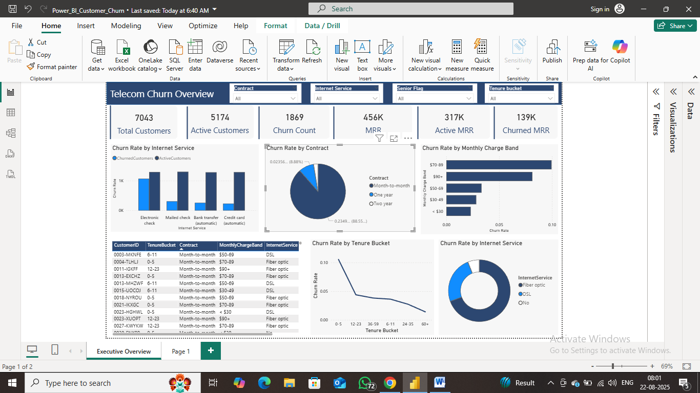

________________________________________
Project Report: Telecom Customer Churn Analysis

1. Project Overview
This project presents a comprehensive analysis of customer churn for a fictional telecom company. The primary objective was to perform an exploratory and descriptive analysis to identify the key factors and patterns that lead to customers discontinuing their services. By leveraging a dynamic Power BI dashboard, the analysis uncovers critical business insights that can empower the company to formulate targeted strategies for improving customer retention.

2. Problem Statement
"An exploratory and descriptive analysis to understand the patterns and behaviours leading to customer churn in a telecom company, aimed at uncovering key business insights that could help reduce customer loss."
 Customer churn is a critical challenge for subscription-based businesses like telecommunications, directly impacting revenue and growth. The high cost of acquiring new customers makes retaining existing ones a top priority. The core business problem is a lack of clear, data-driven understanding of why customers are leaving. This project addresses this by asking: "What are the primary drivers of customer churn, and which customer segments are most at risk?" Answering this question is the first step toward developing effective retention strategies to reduce customer loss and protect revenue streams.

3. Data Source
The analysis was performed on a telecom customer dataset containing 7,043 records, with each record representing a unique customer. The dataset includes a rich set of attributes covering:
•	Customer Demographics: Fields like SeniorCitizen, Partner, and Dependents.
•	Account Information: Details such as Contract type, PaymentMethod, MonthlyCharges, and tenure.
•	Service Usage: Information on subscribed services like InternetService, TechSupport, and OnlineBackup.
•	Churn Status: The target variable indicating whether a customer has churned.

4. Methodology and Tools
The entire analysis was conducted within Microsoft Power BI, following these steps:
1.	Data Cleaning and Transformation: Power Query was utilized for initial data preparation, including creating calculated columns such as tenure and monthly charge buckets for more effective segmentation.
2.	Data Modeling & DAX Calculations: A data model was established in Power BI. To derive meaningful insights, several key performance indicators (KPIs) and measures were created using Data Analysis Expressions (DAX). The core measures include:
o	Total Customers & Churned Customers: Basic counts to establish the scale of churn.
o	Churn Rate: DIVIDE([Churned Customers], [Total Customers]) - The primary KPI to measure the percentage of customers lost.
o	MRR (Monthly Recurring Revenue): SUM(Customers[MonthlyCharges]) - To quantify the financial value of the customer base.
o	Active MRR & Churned MRR: Calculated to understand the financial impact of customer churn.
3.	Dashboard Visualization: An interactive dashboard was built to visualize the findings, allowing for dynamic filtering and drill-down into different customer segments.

5. Key Findings and Insights
The analysis revealed several distinct patterns associated with customer churn:
•	Contract Type is a Major Predictor of Churn: As seen in the "Churn Rate by Contract" visual, customers on a Month-to-Month contract churn at a significantly higher rate than those on One-Year or Two-Year contracts. This suggests a lack of long-term commitment is a major risk factor.
•	New Customers Are Most At-Risk: The "Churn Rate by Tenure Bucket" chart clearly shows that the churn rate is highest for new customers (0-5 months tenure) and decreases sharply as customer tenure increases. This highlights a critical early-stage window for customer retention efforts.
•	Higher Monthly Charges Correlate with Higher Churn: The "Churn Rate by Monthly Charge Band" indicates that customers in the higher-priced tiers (e.g., 89 and $90+) are more likely to churn. This points towards price sensitivity being a key factor in the churn decision.
•	Internet Service Type Plays a Role: The dashboard shows that customers with Fiber optic internet service have a higher churn rate compared to those with DSL. This could be due to factors like perceived value for money, service reliability, or more aggressive competition in fiber-optic-served areas.
•	Payment Method Indicates Risk: The "Churn Rate by Internet Service" bar chart shows that customers using Electronic check as their payment method churn more frequently. This payment method is less automated and may indicate a lower level of integration with the company's services.

6. Recommendations
Based on the insights gathered, the following data-driven recommendations can be made to help reduce customer churn:
1.	Develop a Proactive Retention Strategy for Month-to-Month Customers: Create targeted marketing campaigns that offer incentives (e.g., a small discount, a free service add-on) for month-to-month customers to upgrade to a one or two-year contract.
2.	Enhance the New Customer Onboarding Experience: Since churn is highest in the first few months, implement a robust onboarding program. This could include welcome calls, usage tutorials, and a satisfaction check-in after 30 days to address any early issues.
3.	Review Pricing and Offer Loyalty Rewards: For customers in high-value, high-churn segments (e.g., high MRR with fiber optics), consider introducing loyalty discounts or value-added services to increase the perceived value and justify the premium price.
4.	Investigate Fiber Optic Service Satisfaction: Conduct a deeper analysis (e.g., surveys, support ticket analysis) on the fiber optic customer base to understand the specific pain points driving them to churn.
5.	Incentivize "Stickier" Payment Methods: Encourage customers to switch from Electronic checks to automated payment methods like credit card or bank transfer auto-pay, potentially by offering a small, one-time bill credit.

Tools Used
*   Power BI: For data modeling, DAX calculations, and interactive dashboard creation.
*   Power Query: For data cleaning and transformation.
*   DAX: For creating custom measures and KPIs.

